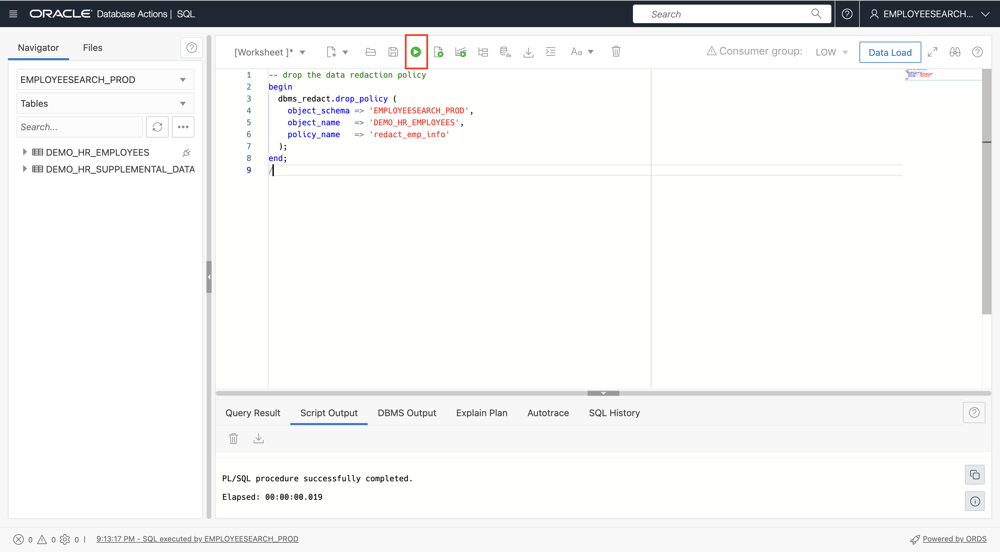

# Reset your environment

## Introduction

In this lab, we will show you how to teardown your Autonomous Database instance. This will reset your environment to as it was before.

Estimated Time: 4 minutes

### Objectives

In this lab, you will complete the following tasks:

- Drop the Audit and Redaction Policy
- Drop EMPLOYEESEARCH_PROD schema and objects
- Verify the schema, the redaction policy, and the unified audit policy have been removed
- Terminate your ADB Instance
  
### Prerequisites

This lab assumes you have:
- An Oracle Cloud Infrastructure (OCI) tenancy account
- Completed all of the previous labs in the **Protect sensitive data in REST GET calls using Oracle Data Redaction** LiveLab workshop

*Warning: Terminating resources may take a few minutes*

## Task 1: Drop Audit policy and then the Redaction policy.
1. Since our Unified Audit policy has served its purpose, we can drop it as we do not need to audit every single SELECT statement. As **ADMIN**, run the following script:

    ```
    <copy>
    noaudit policy audit_hr_select;
    drop AUDIT POLICY audit_hr_select;
    /</copy>   
    ```

    
   
2. Navigate back to the **SQL window** for `EMPLOYEESEARCH_PROD` and **drop the redaction policy**.
    
    ```
    <copy>BEGIN
            dbms_redact.drop_policy (
            object_schema => 'EMPLOYEESEARCH_PROD',
            object_name   => 'DEMO_HR_EMPLOYEES',
            policy_name   => 'redact_emp_info'
            );
        end;
    /</copy>   
    ```
    

## Task 2: Drop the EMPLOYEESEARCH_PROD schema and objects

1. As **ADMIN**, navigate to the Database users

    

2. Click the 3 dots on **EMPLOYEESEARHC_PROD** and click **Delete**

    

3. Choose **Cascade** and **Drop REST Services**

    

4. Delete user

## Task 3: Verify the schema, the Redaction Policy, and the Unified Audit Policy have been removed

1. As **ADMIN** in SQL Worksheet, perform the following query to make sure the user has been deleted
select * from dba_users where username = 'EMPLOYEESEARCH_PROD';

 ```
    <copy>
    select * from dba_users where username = 'EMPLOYEESEARCH_PROD';
    /</copy>   
  ```

2. As **ADMIN** in SQL Worksheet, verify the unified audit policy has been deleted.
select * from AUDIT_UNIFIED_POLICIES where policy_name = 'AUDIT_HR_SELECT';

 ```
    <copy>
   select * from AUDIT_UNIFIED_POLICIES where policy_name = 'AUDIT_HR_SELECT';
    /</copy>   
  ```

3. As **ADMIN** in SQL Worksheet, verify the Oracle Data redaction policy has been deleted"
select * from redaction_policies where policy_name = 'REDACT_EMP_INFO';

 ```
    <copy>
   select * from redaction_policies where policy_name = 'REDACT_EMP_INFO';
    /</copy>   
  ```

## Task 4: Terminate the Autonomous Database Instance

1. Navigate back to your Autonomous Database instance page on OCI.

    

2. At the top menu bar, under More Actions, select Terminate.

   

3. In the pop-up window, type in the name of your database, then select Terminate Autonomous Database.

   

## Acknowledgements

- **Authors** - Alpha Diallo & Ethan Shmargad, North America Specialists Hub
- **Creator** - Pedro Lopes, Database Security Product Manager
- **Last Updated By/Date** - Alpha Diallo & Ethan Shmargad, February 2023
