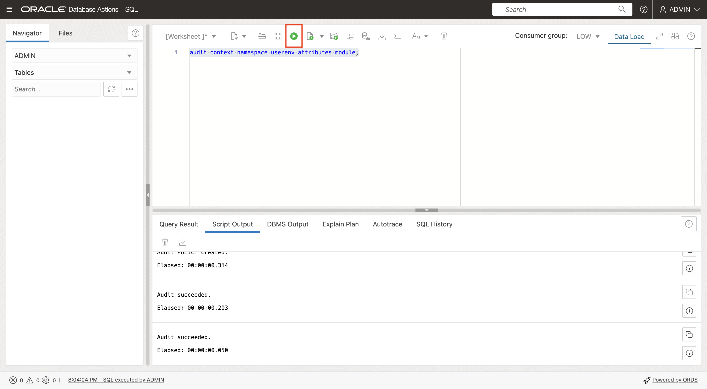
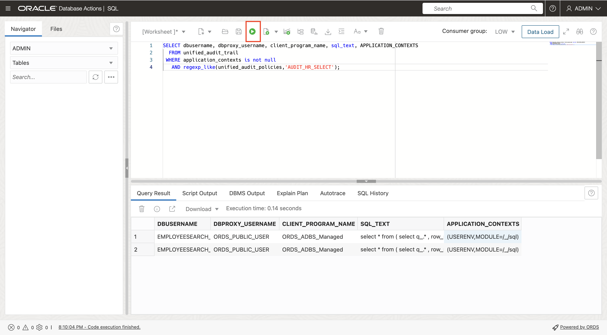
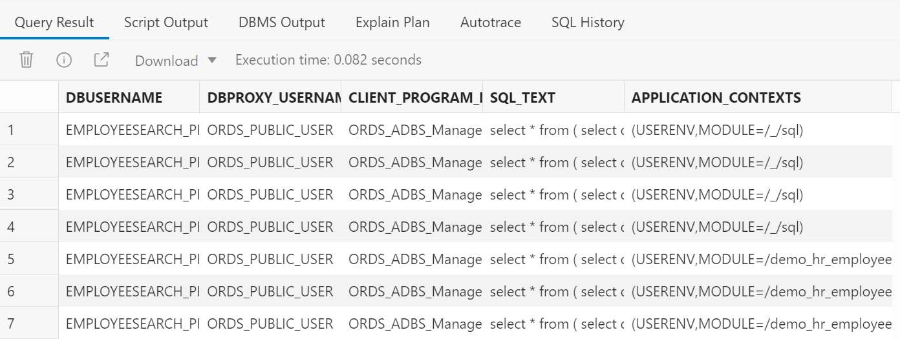
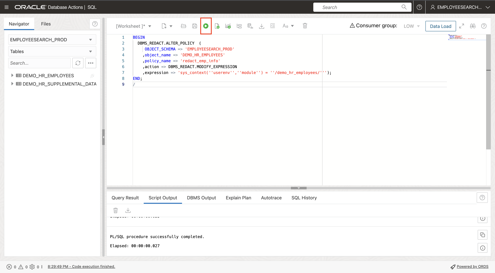
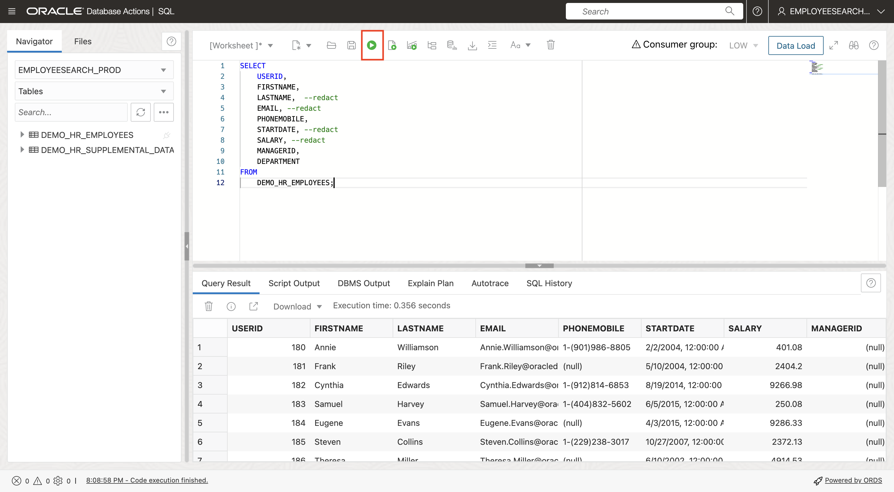
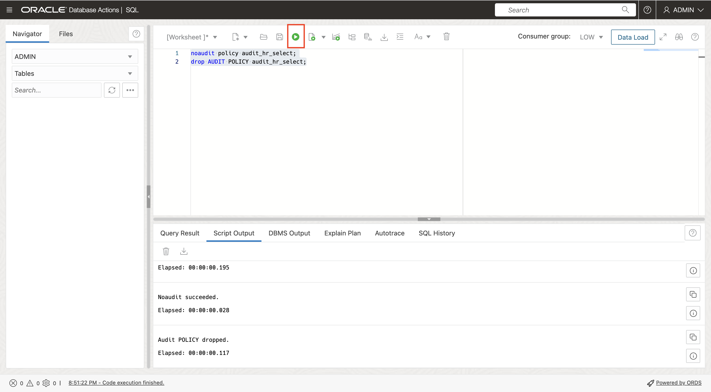

# Use Redaction to Anonymize only REST calls

## Introduction

In Lab 2, we used Oracle Data Redaction to redact all data queried from the `DEMO_HR_EMPLOYEES` table with the expression '1=1'. In this lab, we will identify the module used by the REST call and only redact the results of the REST call. This will allow Database Actions SQL, as well as all other queries, to return unredacted data.

Estimated Time: 15 minutes

### Objectives

In this lab, you will complete the following tasks:

- Identify the session information of the REST call and create a Unified Audit policy
- View the employee query and REST call data before changing the redaction policy and examine audit records
- Update Redaction policy then review employee query data, REST call data and audit records
- Drop audit policy and redaction policy.

### Prerequisites

This lab assumes you have:
- An Oracle Cloud Infrastructure (OCI) tenancy account
- Completed all of the previous labs in the **Protect sensitive data in REST GET calls using Oracle Data Redaction** LiveLab workshop

*Warning: Terminating resources may take a few minutes*

## Task 1: Identify the session information of the REST call and create a Unified Audit policy.

1. The first thing we need to do is to identify the session information of the REST call. We will do this by auditing all sessions that execute a SELECT on the `DEMO_HR_EMPLOYEES`. We will create, and enable, a Unified Audit policy for this. Navigate to the `ADMIN` SQL Window, paste the following script, then run the statement. This script will create the audit policy.

    ```
    <copy>CREATE AUDIT POLICY audit_hr_select ACTIONS SELECT on employeesearch_prod.demo_hr_employees;</copy>   
    ```
    
    

2. Run the following script to enable the Unified Audit policy.

    ```
    <copy>audit policy audit_hr_select;</copy>   
    ```
    
    
3. Now, we also want to include the information on the module that is being used in the query. This will give us additional information to narrow down the REST call.

    ```
    <copy>audit context namespace userenv attributes module;</copy>   
    ```
    
    

## Task 2: View the Employee query and REST call data before changing the redaction policy and examine audit records

1. Navigate back to `EMPLOYEESEARCH_PROD` and run the query again.
    ```
    <copy>SELECT
        USERID,
        FIRSTNAME,   
        LASTNAME,  --redact
        EMAIL, --redact
        PHONEMOBILE,
        STARTDATE, --redact
        SALARY, --redact
        MANAGERID,
        DEPARTMENT
    FROM
        DEMO_HR_EMPLOYEES;</copy>   
    ```
    The data will still show as redacted because we have not yet changed our redaction policy.

    

2. As `ADMIN`, verify there is a new audit record for our newly-created Unified Audit policy in the Unified Audit Trail.

    ```
    <copy>SELECT dbusername, dbproxy_username, client_program_name, sql_text, APPLICATION_CONTEXTS
        FROM unified_audit_trail
    WHERE application_contexts is not null
        AND regexp_like(unified_audit_policies,'AUDIT_HR_SELECT');</copy>  
    ```
    
3. Now, run the REST call from your browser by refreshing the browser tab. The data will be redacted.
    
4. Again, as `ADMIN`, you should see additional audit records in the Unified Audit Trail. These new audit records should show differences in the values of the application\_contexts column. For example, Database Actions SQL will show a value of: '/\_/sql/', while the Oracle Rest Data Services CALL will show the value of application\_contexts column as:
'/demo\_hr\_employees/'
    
## Task 3: Update Redaction policy then review employee query data, REST call data and audit records
1. Next, as `EMPLOYEESEARCH_PROD`, we will update the Oracle Data Redaction policy parameter expression from '1=1' to what we know our REST Call uses.

    ```
    <copy>BEGIN
    DBMS_REDACT.ALTER_POLICY  (
        OBJECT_SCHEMA => 'EMPLOYEESEARCH_PROD'
        ,object_name => 'DEMO_HR_EMPLOYEES'
        ,policy_name => 'redact_emp_info'
        ,action => DBMS_REDACT.MODIFY_EXPRESSION
        ,expression => 'sys_context(''userenv'',''module'') = ''/demo_hr_employees/''');
    END;
    /</copy> 
    ```
    
2. Now, re-run the query as `EMPLOYEESEARCH_PROD` in Database Actions SQL.  The data should no longer be redacted.

    ```
    <copy>SELECT
        USERID,
        FIRSTNAME,   
        LASTNAME,  --redact
        EMAIL, --redact
        PHONEMOBILE,
        STARTDATE, --redact
        SALARY, --redact
        MANAGERID,
        DEPARTMENT
    FROM
        DEMO_HR_EMPLOYEES;</copy>   
    ```
    
3. Also re-run the REST Call. The data should still be redacted.
    
## Task 4: Drop Audit policy and then the Redaction policy.
1. Since our Unified Audit policy has served its purpose, we can drop it as we do not need to audit every single SELECT statement. As `ADMIN`, run the following script:
    ```
    noaudit policy audit_hr_select;
    drop AUDIT POLICY audit_hr_select;  
    ```
    
2. Navigate back to the **SQL window** for `EMPLOYEESEARCH_PROD` and **drop the redaction policy**.
    
    ```
    <copy>BEGIN
            dbms_redact.drop_policy (
            object_schema => 'EMPLOYEESEARCH_PROD',
            object_name   => 'DEMO_HR_EMPLOYEES',
            policy_name   => 'redact_emp_info'
            );
        end;
    /</copy>   
    ```
    

## Acknowledgements

- **Authors** - Alpha Diallo & Ethan Shmargad, North America Specialists Hub
- **Creator** - Pedro Lopes, Database Security Product Manager
- **Last Updated By/Date** - Alpha Diallo & Ethan Shmargad, February 2023
